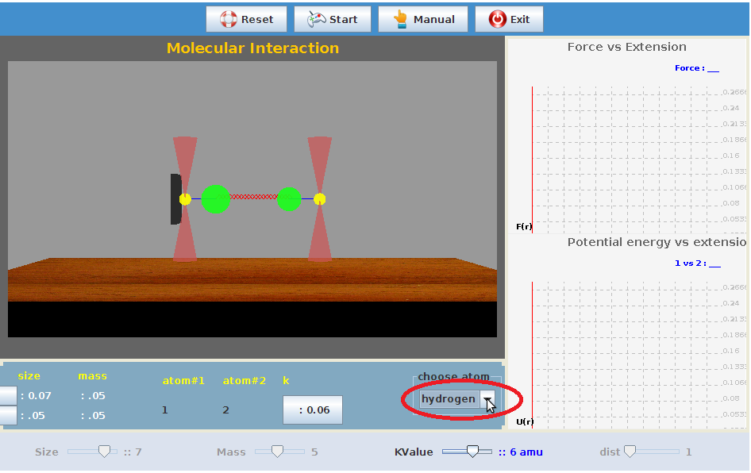
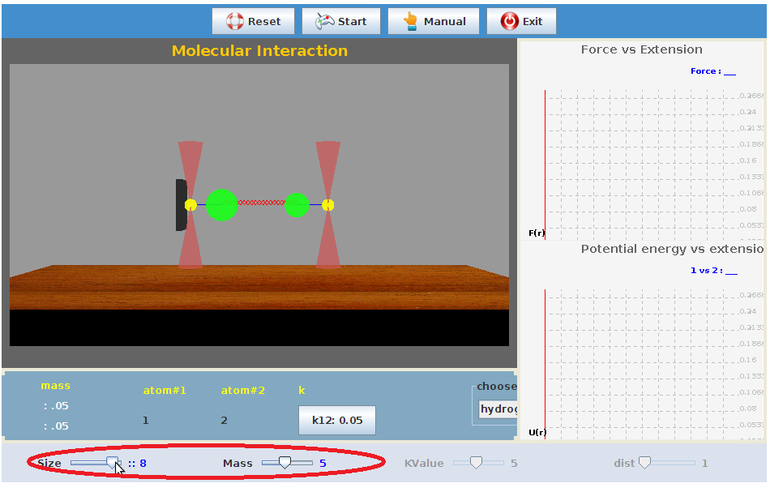
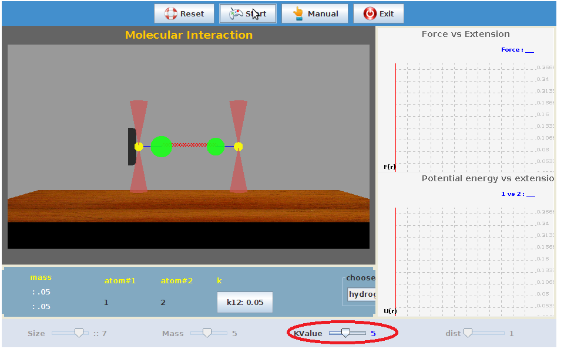
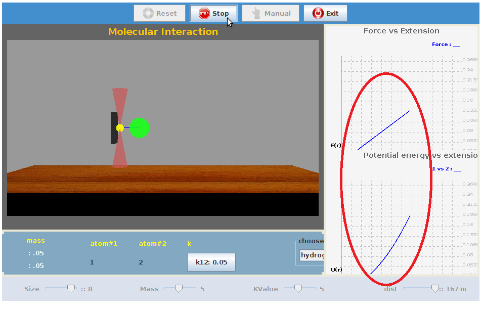
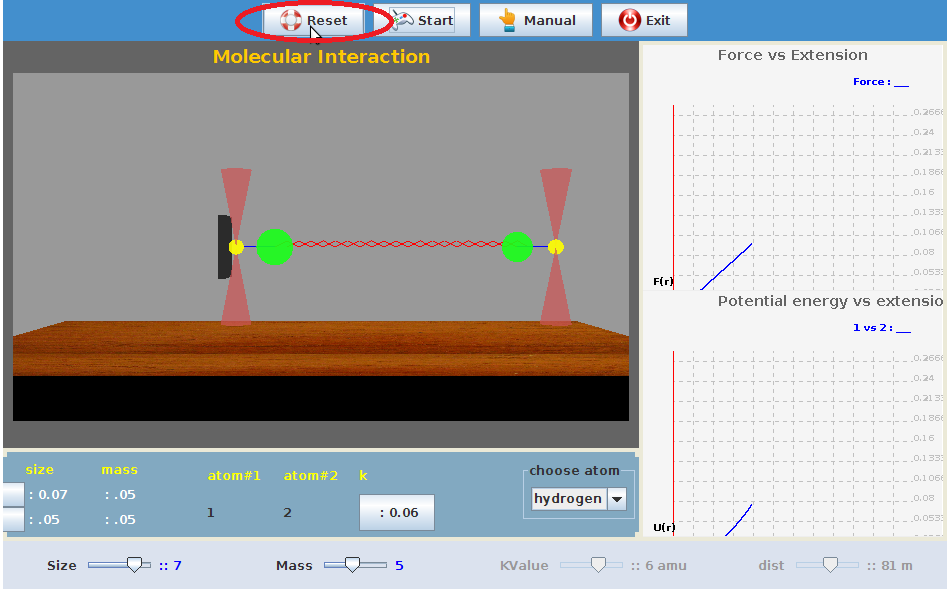
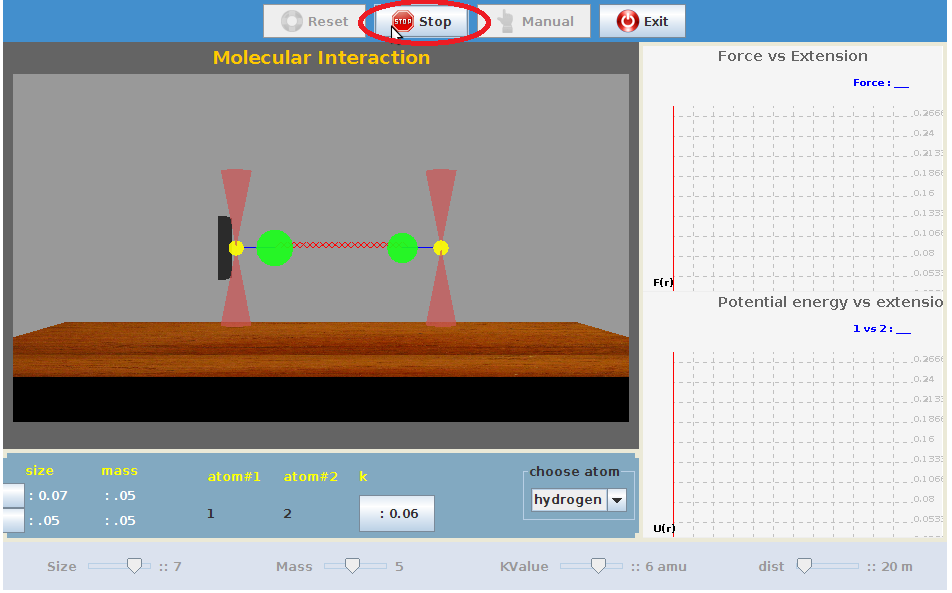

The initial display shows the experimental set up for a default diatomic molecule. To perform this experiment on a molecule of your choice, there are certain parameters to be initialized and the procedure detailed here can be followed.

STEP 1 : Select the suitable method through which you want to determine nature of internuclear forces.

     

STEP 2:The size of atoms can be varied using the sliders shown below.

STEP 3:Select a suitable value of the spring constant using the sliders provided on the display menu and start the experiment..

Step 4:The internuclear force and the potential energy are plotted as a function of the internuclear seperation.

Step 5: The experiment can be reintialized by using the 'Reset' rado in display menu.

Step6: The experiment can be terminated by using 'Stop' in the display menu.

